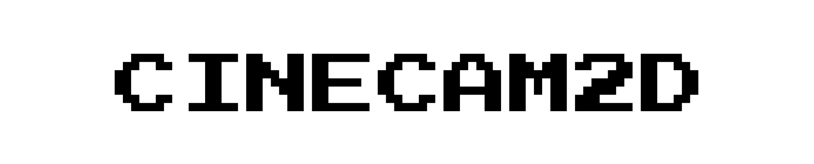

# CineCam2D

<!-- Centered Project Logo -->
<p align="center">
  
</p>

<p align="center">
CineCam2D is a 2D camera library for games and other interactive applications built on top of <a href="https://bevyengine.org/" target="_blank">Bevy</a>. Add features like focus, bounding box, panning, shake, and zoom to your Bevy application with ease.
</p>

<!-- Demo GIF -->
<p align="center">
  
</p>

## Features

-   **Focus**: Camera focus/tracking on a single or on multiple entities, with optional smoothing.
-   **Bounding Box** (`bound` feature): Constrain camera within a bounding box.
-   **Panning** (`pan` feature): Manual camera panning.
-   **Zooming** (`zoom` feature): Manual camera zooming.
-   **Shake** (`shake` feature): Camera shake effects using random noise.

## Installation

Add `cinecam2d` to your `Cargo.toml`:

```toml
[dependencies]
cinecam2d = "0.1.0"
```

## Optional Features

The features in this library are optional, you can enable them by adding the following to your `Cargo.toml`. The `focus` feature is enabled by default.

```toml
[dependencies]
cinecam2d = { version = "0.1.0", features = ["bound", "pan", "shake", "zoom"] }
```

## Quickstart

Add `cinecam2d` to your Bevy app:

```bash
cargo run --example basic
```

```rs
use bevy::prelude::*;
use cinecam2d::CineCam2DPlugin;

fn main() {
    App::new()
        .add_plugins(DefaultPlugins)
        // Use this instead for pixel perfect rendering
        // .add_plugins(DefaultPlugins.set(ImagePlugin::default_nearest()))
        .add_plugins(CineCam2DPlugin)
        .add_systems(Startup, world_setup)
        .run();
}

fn world_setup(mut commands: Commands) {
    cinecam2d::init(&mut commands, Transform::from_xyz(0.0, 0.0, 10.0));
}
```

## Focus Camera on an Entity

Check the [example](/examples/focus.rs) for more settings.

```bash
cargo run --example focus
```

```rs

```

Focusing on multiple entities work the same way, just add the `FocusTarget` component to each entity.

## Apply Bounding Box

Check the [example](/examples/bound.rs) for more settings.

```bash
cargo run --example bound
```

```rs

```

## Panning

Check the [example](/examples/pan.rs) for more settings.

```bash
cargo run --example pan
```

```rs

```

## Zooming

Check the [example](/examples/zoom.rs) for more settings.

```bash
cargo run --example zoom
```

```rs

```

## Shake Camera

Check the [example](/examples/shake.rs) for more settings.

```bash
cargo run --example shake
```

```rs

```

## License

This project is under the MIT License - see the LICENSE.md file for details.
